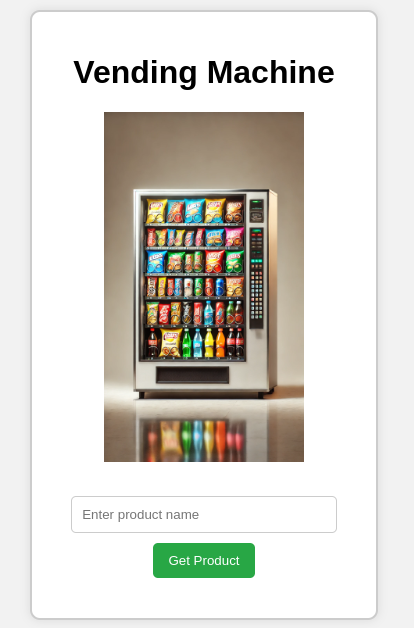
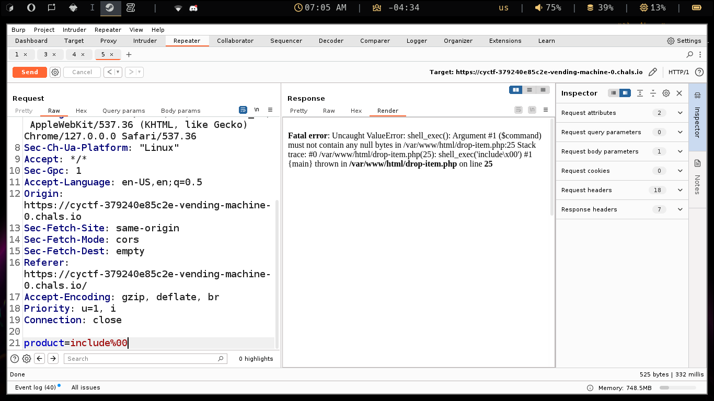
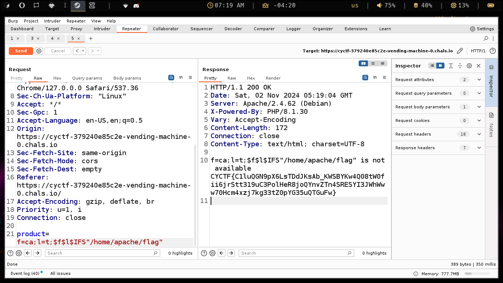

# Vending Machine
First we try writing soda to understand how it works. When u right soda/chips it prints “dropping soda/chips…”. and the product img is dropping from the vending machine pic.


Then i tried to see the source and i found a JS file that contains where `product` is a map for some defined products (where they their images on the server)
```javascript
setTimeout(async () => {
// Wait for PHP response
const response = await sendProduct(input);
		output.innerHTML = response; // Show PHP response
		item.style.transform = "translateY(0)"; // Reset position for next drop
		setTimeout(() => item.style.display = "none", 1000); // Hide item after a second
	}, 2000); // Time it takes to drop the item
	if (products[input.toLowerCase()]) {
		output.innerHTML = `Dropping ${input}... 🥳`;
		// Show item and animate drop
		item.style.display = "block"; // Show the item
		item.innerHTML = ``; // Set image source
		// Move item up to simulate dropping down
		item.style.transform = "translateY(-60px)"; // Move up to simulate dropping down
	} 
	// Clear input field
	document.getElementById('product-input').value = '';
}
// Function to send product to PHP and return response
async function sendProduct(product) {
    const response = await fetch('drop-item.php', {
        method: 'POST',
        headers: {
            'Content-Type': 'application/x-www-form-urlencoded',
        },
        body: `product=${encodeURIComponent(product)}` // Send product name
    });
    if (response.ok) {
        const responseData = await response.text(); // Get the response text
        return responseData; // Return response to be displayed
	} else {
        return "Error communicating with the server."; // Handle errors
    }
}
```
at the first i tried many rabbit holes like XSS and SQLi, i stayed alot trying an SQLi :\ , any way i tried to understand what characher is work and what’s doesn’t, i found that `[<,>,SPACE,+,\,COMMA]` r disappearing when i send to the server.
i tried to inject a php code thinking it may work but i found that when i send `echo` with a non alphabatic after and before it it disappears.
Here i was likely thinking it’s something like a php injection :)
Any way when i searched to understand what NoSQLi is i tried some payloads and it didn’t work at all even the SQLi i used.
Then when i tried to add a null byte `%00` it ruined the app and gave me this.



As u can see the app is using `shell_exec($command)` where the `$command` is the `product` in our request.
Sooooo i got that there is a command injection here (where i didn’t learn yet).
I tried some basic command and all of them r disappearing, i thought i should use a different type of dealing with the server but there wasn’t.
I tried to find a way to make the command with separating it with something in between that the shell understand it means nothing but i didn’t find anything.
And then i remembered something in Linux that u can call a command when it’s a value of a variable like executing `$VAR` if VAR is a command it will be executed.
Soooo let’s separate our commands into 2 vars and see what’s happening.
i sent this payload `f=l;l=s;$f$l` and it responed with this
```text
f=l;l=s;$f$l is not available Dockerfile
assets
docker-compose.yml
drop-item.php
entrypoint.sh
index.html
script.js
styles.css
```
Hehehe 😍, now the game is on.
But wait… we still can’t separate the space : | , i searched alot on how to get an alterative to the space in linux shell then i found `$IFS`, then i tried to add a word after the variable to make it work well so i used `$IFS"arg"` and it worked well.
So when catting `entrypoint.sh` we found there this script 
```shell
#!/bin/sh
echo "$FLAG" > /home/apache/flag && chmod 644 /home/apache/flag && apache2-foreground
```
Now we can peacfully get the flag by `f=ca;l=t;$f$l$IFS"/home/apache/flag"` 



The flag: `CYCTF{C1luQGN9pX6LsTDdJKsAb_KWSBYKw4Q08tW0fii6jrStt319uC3PolHeR8joQYnvZTn4SRESYI3JWhWww70Hcm4xzj7kg33tZ0pYG35uQTGuFw}`

