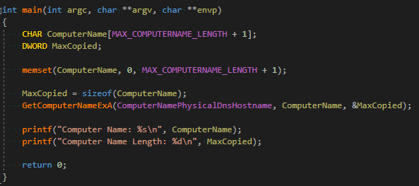
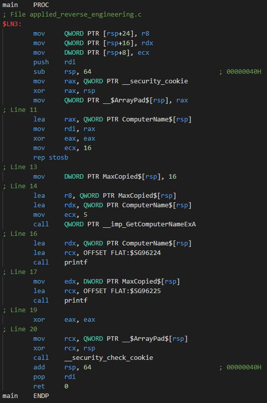
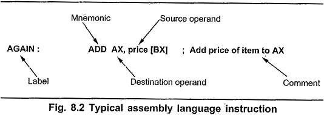
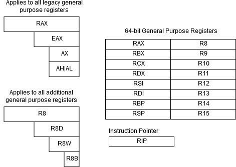
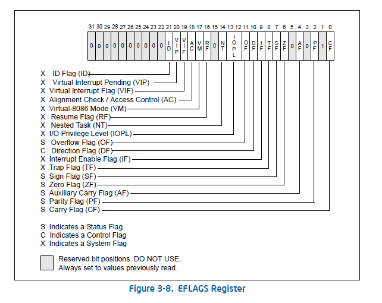

# Objectives
Summarizing this article [Basic Architecure](https://revers.engineering/applied-re-basic-architecture/)
We will only cover the intel x64 arch.
1. General purpose registers
2. The processor state flag
3. The ISA
4. Virtual memory
5. Execution of a process on the x64 arch

# High Level Introduction

## The Compilation Process
$$\text{Source Code }\xrightarrow[]{\text{Compiler}}\text{Assembly Code }\xrightarrow[]{\text{Assembler}}\text{Object Code }\xrightarrow[\text{Libs used}]{ \text{Linker}}\text{Exec. Code}$$
```latex
\text{Source Code }\xrightarrow[]{\text{Compiler}}\text{Assembly Code }\xrightarrow[]{\text{Assembler}}\text{Object Code }\xrightarrow[\text{Libs used}]{ \text{Linker}}\text{Exec. Code}
```
1. Compiler: Convert the source code to the assembly instructions
2. Assembler: Convert the asm instructions to object code
3. Linker: Convert the unusable asm code to an executable program just by linking the code with the needed libraries
## Compiled Binary BreakDown
We will breakdown this C program that gets the physical computer name and print it out with it's length
 

> You can convert this C code to asm code using `gcc -S code.c`

But in this article he used visual studio to read the asm code


Each line in this code is an instruction where, where the instructions avaliable differs from arch to arch, this is for the x64 arch.
This figure shows the strucure of assembly instructions:

Each instruction starts with a mnemonic like `mov dest, source`(to store *source* in *dest*) and `call`(a function invocation).
You must take in consern that the 9 lines C code converted to a 25 lines ASM code that are run directly through the processor to perform billions of operations in seconds.

# The MicroArchitecure
Microarchitecture is all the digital logic that allows an instruction set to be executed. It’s the combination of memory, ALUs, registers, logic gates, and so on. When you combine all of these components you wind up with a processor.
But the component we will cover in this article is the register file.

> **[Operands](https://en.wikipedia.org/wiki/Operand)** refer to the data being operated on.

Some instructions has one, two, or three. Like line 19 `xor eax, eax` each `eax` is an operand. These operands are CPU registers.

## The Register File
Every processor needs to perform operations on data, these data must be stored temporarily. This is the purpose of processor's register file(Which is a component in the CPU).
But some data needed will be in the memory so the processor take it and store it in the register till the operation that needed it ends. Think of the register as an empty slot. Where Each slot is filled with data and instructions can perform operations on this data before sending it to memory or storing it in another register.

On the intel x64 arch register file contains 16 general purpose registers, each is 64-bits in size. The sizes for each of these registers is usually referred to use of terms such as:
- Word -> 16-bits -> 2 bytes
- doubleword -> 32-bits -> 4 bytes
- quadword -> 64-bits -> 8 bytes
- ...
## Register Fundamentals
These previous 16 general purpose regisers perform basic data movement, control workflow operations, string operations,... .
Here is a table of the general purpose registers.

To explain this, there are 16 general purpose registers. Each register on the 64-bit arch is 64-bits wide. However, on 32-bit archs there were only 8 general purpose registers. `RAX` in x64 arch is reduced to `EAX` with 32-bit size in the x86 arch. In addition, in the x64 arch they added 8 more registers which are from R8-R15. You can still access the lower portion of registers. Back in the old days of 16-bit arch there isn't `RAX` neither `EAX`, there were only `AX`.
You can access the low word of the register `EAX` as you can you the register `AX`.
```asm
xor eax, 10000539h    ; xor eax with 0x10000539
mov var, ax           ; var = 0x0539
```
We do this when we want a specific part from a larger part like taking the lower word of the `RAX` using `AX`. Also you can access smaller parts of additional general purpose registers using the register names with the size like `R8b`,`R8w` or `R8d`.
Also the `RIP` register(Register Instrucion Pointer) which hold the memory address of the next instruction to be excecuted, and it's moves based on the type of the instruction executed. Usually `RIP` is automatically move to the next execution by increament the past instruction size in memory, but in case of if statement it's works differs and this will point to soon.
## Processor State Flag Register
Called the [**EFLAGS**](https://en.wikipedia.org/wiki/FLAGS_register) register, but called **[RFLAGS](https://en.wikipedia.org/wiki/FLAGS_register)** register in 64-bit mode. It may also called the current program status register (CPSR). It's a 32-bits register contains flags related to the state of the processor state in the current execution. The flags functions divided into to types:
1. Control where branching instructions go.
2. Control OS related operations.
A small group of the status flags affected by arithmatic operations, the rest have definitions in there manuals.
This figure shows the EFLAGS register:

We will cover some of the status flags.
## The Zero Flag
The Zero Flag(ZF) is a status flag where it's set if and only if the arithmatic instruction result is 0. 
We will discuss this flag on this code
```c
#include<stdio.h>
int Integer0, Integer1;

Integer0 = 510;
Integer1 = 511;

if ((Integer0 - Integer1) == 0)
    printf("ZF set, execute this block.\n");
else
    printf("ZF not set, execute this block.\n");
```

This code can written in assembly as follows(We took the only part we just need):
```assembly
    mov rax, 510
    mov rbx, 511
    sub rax, rbx
    jnz zf_not_set
    lea rcx, offset zf_set_string
    call printf
    jmp end
.zf_not_set:
    lea rcx, offset zf_not_set_string
    call printf
.end:
    ret
```

There at the `sub` instruction we subtracted 510 from 511 which is 1(not zero) then it will not set the ZF in the EFLAGS register. Now the `jnz`(**J**ump if **N**ot **Z**ero) will check the ZF if it's not set then the jump will be taken and we will jump to the label `.zf_not_set`, where we will take the zf_not_set_string and call printf. So, if the ZF was set it would take the zf_set_string and call the printf function then end the program.
## The Sign Flag
It's a flag for signed operations, and it's:
- Set to on   if result is < 0
- Set to off  if result is >= 0
We will discuss this code:
```c
int Integer0, Integer1;

Integer0 = 1;
Integer1 = 1000;

if ((Integer0 - Integer1) < 0)
    printf("SF set, execute this block.\n");
else
    printf("SF not set, execute this block.\n");

return 0;
```
And that's the assembly we need from it:
```assembly
    mov rax, 1
    mov rbx, 1000
    sub rax, rbx
    jge sf_not_set
    lea rcx, sf_set_string
    call printf
    jmp end
.sf_not_set:
    lea rcx, sf_not_set_string
    call printf
.end:
    xor eax, eax
    ret
```

We can use the SF(Sign Flag) using the mnemonic `jge`(**J**ump if **G**reater than or **E**qual 0). Which will jump to the label sf_not_set if the SF is set to 0(result is >= 0) and there it will print the sf_not_set_string using the printf function.

## The Carry Flag
The Carry Flag(CF) function is to handle the overflow resulting from the unsigned arithmatic operations. Like: adding 255 and 1 to a 8-bit register will make an overflow, this flag is responsible for handling this.
> There is a separate flag to handle the overflow in the signed arithmatic operations(OverFlow Flag)


# Conclusion
In this article we have talked about:
- We talked about the compilation process
- We talked about Register file and it's fundamentals
- We talked shortly about the EFLAGS
- Also we spoke about some processor state flags:
	- Zero Flag
	- Sign Flag
	- Carry Flag
